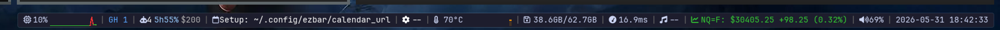

# ezbar

A status bar for [Sway](https://swaywm.org). GPU-rendered with
[iced](https://iced.rs) on `wlr-layer-shell` — no GTK, no config DSL, no IPC.
Widgets are just Rust.



*The default look: **lilac islands** — square panels floating over your wallpaper,
filled GPU sparklines, a dark base. Square, not rounded; dark, not busy. Drop in a
[preset](#theme-it) to reskin the whole thing in seconds.*

Workspaces, focused-window title, clock, CPU / temperature / memory / ping
graphs, volume, battery, GitHub notifications, Google Calendar, Spotify, kubectl
context, a stock ticker, and a live Claude-usage widget. Clicking, scrolling and
hover popups all work; popups are real layer-shell surfaces, not overlays.

## Build

Needs stable Rust (≥ 1.88) and a Wayland + Vulkan stack.

**Arch / AUR:**

```bash
yay -S ezbar
```

**Arch:**

```bash
sudo pacman -S --needed rust wayland libxkbcommon vulkan-icd-loader fontconfig
# + a driver: vulkan-radeon | vulkan-intel | nvidia-utils
```

**Debian/Ubuntu:**

```bash
sudo apt install pkg-config libwayland-dev libxkbcommon-dev libvulkan1 \
                 mesa-vulkan-drivers libfontconfig1-dev
```

Then:

```bash
cargo build --release        # -> target/release/ezbar
```

## Run

```bash
./target/release/ezbar
```

Add it to your Sway config — `ezbar install` does this for you (idempotent, and
it never edits or removes an existing line; it backs up the config and appends
one `exec_always`), or add it by hand:

```
exec_always /path/to/ezbar
```

`ezbar` is a thin launcher: it respawns the bar if the output disappears (monitor
sleep / hotplug). For a single foreground instance (debugging):

```bash
EZBAR_CHILD=1 ./target/release/ezbar
```

## Configure

Everything lives under `~/.config/ezbar/` and is optional — a widget with no
config just stays quiet. Nothing is hardcoded; no secrets ship in the binary.
Every module's `[modules.<id>]` options are listed in
[docs/config-reference.md](docs/config-reference.md).

| Widget   | Reads from |
|----------|------------|
| Calendar | `calendar_url` (your secret iCal URL) or `$GOOGLE_CALENDAR_ICAL_URL` |
| GitHub   | `$GH_TOKEN` / `$GITHUB_TOKEN` / `gh auth token`; optional `github_config.json` (`reasons`, `exclude_repos`) |
| Spotify  | `spotify_config.json` (`client_id`, `client_secret`); or `$SPOTIFY_ACCESS_TOKEN` |
| Stock    | `$EZBAR_STOCK_SYMBOL` (default `NQ=F`), `$EZBAR_STOCK_API_KEY` (optional) |
| Ping     | `[modules.ping].target` (default `8.8.8.8`) |

## Theme it

Theming is **live** — edit `[theme]` in `~/.config/ezbar/config.toml` and the bar
re-skins instantly, no restart:

```toml
[theme]
style   = "islands"   # islands (default, floating square panels) | solid (one slab)
primary = "#cba6f7"   # the accent — workspace chip, pill borders, highlights (graphs are per-widget, see below)
background = { base = "#1e1e2e", weak = "#313244", strong = "#45475a" }
text = "#cdd6f4"; ok = "#a6e3a1"; warn = "#f9e2af"; urgent = "#f38ba8"
```

Six ready palettes ship in [`presets/`](presets/) — `ezbar-dark` (the lilac-islands
default), `noir` (the original flat black slab), `catppuccin-mocha`, `gruvbox-dark`,
`nord`, `tokyo-night`. Drop them into `~/.config/ezbar/presets/`, then switch live
from the on-bar `▾`, or from a keybind:

```bash
ezbar msg preset gruvbox-dark   # or: preset next | prev
ezbar msg reload                # popup <kind> | volume <up|down|mute>
```

Presets are theme-only TOML bundles with a `[palette]` variable layer (`primary =
"$mauve"`), selected via a state file that never edits your `config.toml`. Workspace
chips come in four square styles (`boxed` · `filled` · `outlined` · `underbar`).
Full design: [RFC 0002](rfcs/0002-config.md).

### Graph colors (per-widget)

The inline sparklines (`cpu` · `temperature` · `memory` · `ping`) are **functional by
default**: they run green→red by load, so a pinned core *looks* hot. That colour carries
meaning, so it isn't a global theme token — it's a per-widget knob under
`[modules.<id>.graph]`, not `[theme]`:

| `line_color`                                            | line                              |
|---------------------------------------------------------|-----------------------------------|
| `"threshold"` *(default, or omitted)*                   | green→yellow→orange→red by load   |
| `"accent"` `"ok"` `"warn"` `"urgent"` `"fg"` `"fg_dim"` | that theme token, flat            |
| `"#rrggbb"` / `"#rrggbbaa"`                              | that literal colour, flat         |

```toml
# cpu keeps the functional default — leave it out entirely for this
[modules.cpu.graph]
line_color = "threshold"   # green when idle, red when pinned

[modules.temperature.graph]
line_color = "accent"      # flat lilac, matches the bar accent

[modules.memory.graph]
line_color = "#89b4fa"     # a fixed blue
```

Want every graph flat-accent (the r/unixporn ricer look)? Set `line_color = "accent"` on
each — it's deliberately opt-in per widget, so going aesthetic never silently drops the
load signal on a monitor you forgot about. A typo falls back to `threshold`, so a bad
value can't blank a graph.

## Interactions

| Widget | Action |
|--------|--------|
| cpu / temp / mem / ping | click the label to toggle its graph |
| volume | click to mute, scroll to change |
| kubectl | left-click clears the context, right-click opens the picker |
| calendar | click for today's meetings; blinks when one is imminent/ongoing |
| github | click for the grouped list; click a row to open + mark read, right-click to dismiss, `[clear all]` to mark all |
| spotify | click to play/pause (or authorize), scroll to skip; long titles marquee |

## Write a widget

Widgets are pluggable **modules** — just iced, one trait, no IPC. Develop one in
a normal window without launching the bar:

```bash
cargo run -p ezbar-harness --example counter   # a complete starter plugin
cargo run --example harness -- github          # preview a built-in module
```

Guide: [`.claude/skills/ezbar-plugin-author/SKILL.md`](.claude/skills/ezbar-plugin-author/SKILL.md).
Design: [`rfcs/0001-pluggable-modules.md`](rfcs/0001-pluggable-modules.md).

## WASM plugins & capability safety

Drop a `.wasm` (built against the [WASM SDK](.claude/skills/ezbar-wasm-plugin-author/SKILL.md))
in `~/.config/ezbar/plugins/` and it's placeable by its filename. A plugin is sandboxed
(wasmtime); the only things it can do are **read-only and user-granted** in
`[modules.<id>]` — `network` (an HTTP-GET host allow-list), `feeds` (cpu/memory/…), and
`sway` (read-only workspace/title). Nothing else: no fs, no exec, no driving the bar.

Consent is bound to the plugin's **content hash**, not its name (RFC 0014), so a swapped
binary can't inherit a grant:

```sh
ezbar add <id> --registry <dir>   # install from a (local) registry: verify sha256 → install → print grant
ezbar list                  # installed plugins + consent state + declared caps
ezbar inspect my.wasm       # show what it declares + the exact [modules.<id>] block to paste
ezbar grant <id>            # approve the plugin's current bytes (re-run after a rebuild/update)
ezbar remove <id>           # uninstall (deletes the .wasm + consent record, never your config)
ezbar package my.wasm       # author: embed an ezbar:manifest (declared caps) + print the registry entry
```

A plugin's embedded manifest only *declares* what it needs (`ezbar inspect` reads it and
prints the grant block — it never writes your config); the host warns if a plugin declares
a capability you didn't grant. Design: [`rfcs/0014-plugin-registry.md`](rfcs/0014-plugin-registry.md).

## Layout

```
src/              the bar: state, update, view, subscriptions, launcher
src/sources/      one module per data source (off-thread I/O via spawn_blocking)
src/modules/      pluggable widgets (RFC 0001)
src/widgets/      canvas line-graphs
crates/ezbar-plugin    the plugin SDK — the Module trait, stable API
crates/ezbar-harness   standalone dev harness for modules
examples/harness.rs    preview built-in modules
```

Elm architecture: one `State`, one `Message`, `update`, `view`, and one
`Subscription` stream per data source. Popups are extra layer-shell surfaces
(the multi-window daemon pattern).

## License

MIT © Johannes Brüderl
