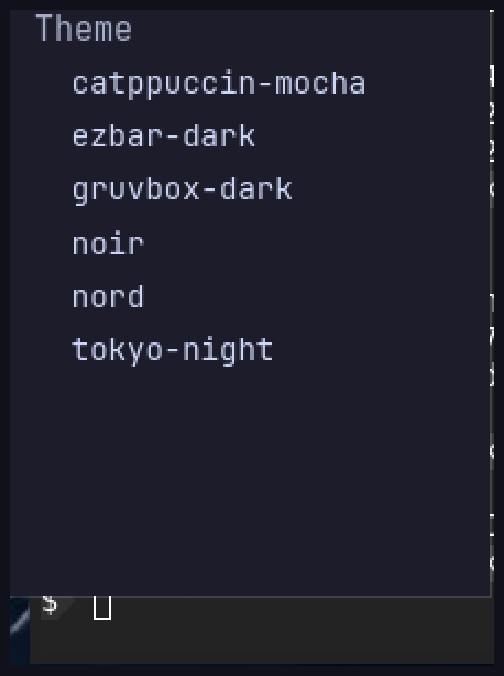

# RFC 0002: Configuration, theming & presets

- **Status:** Draft (v3 — adds presets + live switcher, palette variables, floating
  geometry, graph knobs, and real visual proof; addresses the r/unixporn review)
- **Created:** 2026-05-31
- **Target:** ezbar (Rust / iced / wlr-layer-shell)
- **Depends on:** RFC 0001 (modules) — supersedes its `[bar]`/`[[module]]` sketch.

## Changelog (v3)

A ricer-perspective review scored v2 6/10: the engineering was sound but the
*ricing* story was thin. v3 closes every blocking gap and adds the feature that
turns two of them into a strength:

- **Presets + live switcher (headline).** A **preset** is a named bundle of every
  visual token. They live inline *or* as drop-in files (`presets/*.toml`), are
  switched **live** from a `▾` button on the bar (or `ezbar msg preset …`), and are
  self-contained ⇒ shareable. This subsumes the "no shareable theme file" gap and
  the "where's the live theme switcher" gap in one move — and ashell has neither.
- **Palette variables.** A `[palette]` block of named anchors that tokens reference
  with `$name`. Drop a scheme by editing anchors once, not 18 scattered hex values.
- **Floating-bar geometry.** `[bar].margin` (per-side) + `[bar].radius` so the bar
  can detach from the edge with rounded corners — the front-page silhouette. The
  flat slab was previously unavoidable.
- **Graph knobs.** The sparkline is our identity but had zero config surface. v3
  adds `[modules.<id>.graph]` (samples/height/line color/fill/width/smoothing).
- **Per-module font + padding, font weight, per-zone spacing, glyph separators,
  per-side/per-state border, a `shadow` token.** The knobs ricers actually demand.
- **Real visual proof.** v2 said "screenshot lands later." v3 embeds **actual
  captures** of the running bar — default, a live preset swap, and the workspace
  chips — below. The "designed default" and "live swap" claims are now shown, earned.
- **Scrim-not-blur is stated as a deliberate aesthetic,** not an omission.

(v2 already fixed: key-based stable identity, host-owned `config_generation`
subscription re-keying, `Factory(owned id, &cfg)`, tonal/OkLab tiers, `ezbar msg`.)

## Summary

A single TOML config — `~/.config/ezbar/config.toml` — driving **placement**,
**per-instance options**, a **token-based theme**, **presets with a live switcher**,
**hot-reload**, and an **`ezbar msg` IPC**. **Zero config == today's bar.** Match or
beat ashell's configurability and looks, on sway, our own square/dark/flat way.

## Visual proof

Captures of the running bar (sway, wgpu/Vulkan, JetBrainsMono Nerd Font).

**Zero-config default** — **lilac islands**: square panels floating over the wallpaper,
dark `#1e1e2e` base, flieder/lilac `#cba6f7` accent; Nerd glyphs; GPU sparklines inline.
No emoji, no rounded pills (workspaces island + the right cluster):


**Islands vs solid** — `style` flips the whole look; `solid` (the `noir` preset) is one
flat slab with hairline separators, `islands` floats square panels over the wallpaper:


**Live theme swap** — the *same running bar* re-themed to Catppuccin Mocha by a ~9-line
`[theme]` override, applied by hot-reload with **no restart** (background, separators,
text recolor; semantic graph colors are pinned by default — see `[modules.<id>.graph]`):


**Workspace chips** — square, state-filled (focused = solid accent square), four
selectable styles via `[theme.workspaces].style`, uniform cell width (real captures):


**Popup detail surface** — a real layer-shell surface styled by `[theme.popup]` (dark,
square, hairline border), opaque even when the bar is translucent; the stock popup's
GPU 7-day chart shown:


**Preset switcher** — the `▾` on the bar opens this list of drop-in presets; selecting
one applies **live** (theme-only hot-reload) and persists to the state file. Shipped:



> These are captures of the **current implementation** — config parsing, theme
> hot-reload, square chips, islands, GPU graphs, layer-shell popups, **drop-in
> presets, `$palette` `$ref` resolution, and the `▾` switcher** all run today.
> Also shipped: floating `[bar].margin` geometry, configurable height/position/
> layer, font `weight`, the **`ezbar msg`** IPC (`reload`, `preset
> <name|next|prev>`, `popup <kind>`, `volume <up|down|mute>`), and **config-driven
> placement** — `left`/`center`/`right` id lists select which widgets render and in
> what order, with a glyph/colour separator from `[theme.separator]`. Still
> *proposed* here: per-`key` multi-instance widgets (only RFC 0001 modules carry
> instances today), a `radius` on the solid bar surface, and `[modules.<id>.graph]`
> knobs — each built on the proven hot-reload path above.

## Motivation

Layout is hardcoded; theming was three `const` arrays; no hot-reload; no keybind
IPC; no theme switcher. ashell has the first four. We close the gap and add the
switcher, without copying their identity.

## Relationship to ashell (learn, don't copy)

Study their source for *technique*; implement our **own**. No ashell code, assets,
fonts, or default palette is copied. We **deliberately differ**: default style is
ezbar's **square** islands (a hair of radius, not ashell's rounded pills) with a
flieder/lilac accent; `solid` is one toggle away; default palette is ezbar's own;
placement and options are co-located; identity leans on **GPU graphs** and **square
chips**, plus a **preset switcher** ashell lacks. Where a choice is just good engineering (tonal
palette, file-watch reload, width-state workspaces) we adopt the *idea*, our way. We
do **not** claim the semantic-color schema as ours — it's convergent with ashell and
iced's `palette`.

## Design

### File, format, precedence

`$XDG_CONFIG_HOME/ezbar/config.toml`, parsed with `serde` + `#[serde(default)]`
throughout: missing keys fall back to defaults; **no file == the shipped layout**.
`--config <path>` overrides. Resolution order for any theme token:

```
default  <  active preset  <  top-level [theme]  <  [modules.<id>.theme] (per-instance)
```

so a preset is a *base layer* you can override one key at a time. Secrets/data files
stay separate (not in this file).

### Presets & the live switcher (headline)

A **preset** is a named bundle of *theme-only* tokens (everything under `[theme]`,
incl. `[theme.workspaces]`, `[theme.popup]`, `[palette]`, graph defaults, font). It
is **not** placement — switching your look never reorders your modules.

```toml
[theme]
preset = "tokyo-night"     # the default preset on launch (optional)

# inline preset (same shape as a presets/*.toml file, just nested under [presets.<name>]):
[presets.tokyo-night]
background = { base = "$bg", weak = "$surface", strong = "$over" }
text = "$fg"; dim = "$muted"
primary = "$blue"; ok = "$green"; warn = "$yellow"; urgent = "$red"
separator = { color = "$grey", width = 1 }
# the palette is a SECTION (TOML inline tables can't span lines), one anchor per row:
[presets.tokyo-night.palette]
bg = "#1a1b26"; surface = "#1f2335"; over = "#24283b"
fg = "#c0caf5"; muted = "#565f89"
blue = "#7aa2f7"; green = "#9ece6a"; yellow = "#e0af68"; red = "#f7768e"; grey = "#414868"
[presets.tokyo-night.workspaces]
style = "boxed"; focused = "$blue"; occupied = "$muted"; empty = "$over"; urgent = "$red"
```

**Two sources, both shareable — identical schema:**

- inline `[presets.<name>]` tables, and
- drop-in files `~/.config/ezbar/presets/<name>.toml` whose **body is exactly the
  preset table** (top-level `palette`/`style`/`background`/…, with `[workspaces]` /
  `[popup]` sub-tables) — i.e. the inline form minus the `[presets.<name>]` prefix.
  See `presets/*.toml` in-repo (ezbar-dark, catppuccin-mocha, gruvbox-dark, nord,
  tokyo-night) for the canonical shape. Download a community preset, drop the file in,
  and it appears in the switcher on the next reload — no edit to `config.toml`.

**The switcher (UI in RFC 0003):** a small `▾` button (default: right end of the
bar; `[bar].switcher = "off" | "left" | "right"`). Click → a popup list of presets,
current one marked; click one → **apply live** through the hot-reload theme path
(§Hot-reload). Also driven by IPC: `ezbar msg preset <name|next|prev>`.

**Persistence without touching user config:** the switcher writes the chosen preset
name to `$XDG_STATE_HOME/ezbar/state.toml` (a single `preset = "…"`). On launch the
state file wins over `[theme].preset`; we **never rewrite `config.toml`**. Deleting
the state file falls back to the configured default.

**Sharing (later, out of scope here):** because a preset is one self-contained TOML
file, a community gallery is just a folder/repo of files + a thumbnail; an
`ezbar preset add <url>` fetch helper is a future RFC.

### Palette variables

Authoring a scheme means editing *anchors*, not every semantic token. `[palette]`
(or a preset's `palette = {…}`) defines named colors; any color value may be
`"$name"`, resolved after merge. `$name` not found ⇒ validation error with the line.

```toml
[palette]
base = "#0d1117"; surface = "#161b22"; over = "#21262d"
text = "#e6edf3"; muted = "#7d8590"
blue = "#58a6ff"; green = "#3fb950"; yellow = "#d29922"; red = "#f85149"

[theme]
background = { base = "$base", weak = "$surface", strong = "$over" }
text = "$text"; dim = "$muted"
primary = "$blue"; ok = "$green"; warn = "$yellow"; urgent = "$red"; separator = "$over"
```

Anchors are *optional*: every token still accepts a literal hex. This is the
indirection v2 lacked — semantic tokens, but no variables behind them.

### Top-level shape

```toml
[bar]
position = "bottom"          # top | bottom
layer    = "top"
height   = 34
outputs  = "all"             # "all" | ["DP-1"]
font     = "JetBrainsMono Nerd Font"
weight   = "medium"          # thin|light|normal|medium|semibold|bold
scale    = 1.0               # 0 < x ≤ 2
margin   = { top = 0, bottom = 0, left = 0, right = 0 }   # floating gap from edges
radius   = 0                 # round the BAR SURFACE itself (square identity = 0)
switcher = "right"           # off | left | right  — the ▾ preset button

# placement: ordered; nested array = an island/solid group; entry = id | {id,key,config}
left   = [ "workspaces", "window_title" ]
center = [ "clock" ]
right  = [
  ["cpu", "memory", "temperature"],
  "ping",
  { id = "stock", key = "nasdaq", config = { symbol = "NQ=F" } },
  "github", "calendar", "claude",
  ["volume", "battery"],
]

[theme]
preset    = "ezbar-dark"                 # optional; default look if omitted
style     = "solid"                      # solid (default) | islands
opacity   = 0.95
font_size = 14
spacing   = { zone = 8, group = 4 }      # between groups vs within a group (scalar ok)
padding   = { x = 8, y = 2 }             # inside an island / popup (scalar ok)
radius    = { item = 4, group = 8, popup = 10 }   # scalar also allowed
border    = { width = 1, color = "#ffffff14" }    # hairline; or per-side/per-state below
shadow    = { blur = 8, color = "#0008", y = 2 }  # island/popup drop shadow; off by default
separator = { color = "#30363d", glyph = "", width = 1 }   # color | glyph (e.g. "" "|") | both
background = { base = "#0d1117", weak = "#161b22", strong = "#21262d" }
text = "#e6edf3"; dim = "#7d8590"
primary = "#58a6ff"; ok = "#3fb950"; warn = "#d29922"; urgent = "#f85149"

[theme.popup]                # the detail surface is its own thing
opacity  = 1.0               # opaque even if the bar is translucent
backdrop = 0.3               # dim SCRIM behind the popup (a quad — see below; NOT blur)
radius   = 12

[theme.workspaces]           # state-aware + a style for the chip shape
style    = "boxed"           # boxed | filled | outlined | underbar  (see RFC 0003)
focused="#58a6ff"; occupied="#7d8590"; empty="#30363d"; urgent="#f85149"
colors=["#58a6ff","#3fb950"]; special=["#bc8cff"]

[modules.cpu]                # per-id defaults (merged under each instance's config)
show_graph = true
[modules.cpu.theme]          # per-instance color/font override (shadows global tokens)
primary  = "#9ece6a"
font     = "Iosevka"         # per-module font/size/weight allowed here
[modules.cpu.graph]          # the sparkline knobs (our identity, now tunable)
samples    = 48              # history width
height     = 16
line_color = "$green"        # or a token / hex; default = the module's threshold color
line_width = 1.5
fill       = { gradient = true, alpha = 0.18 }   # area under the line; off = stroke only
smooth     = true            # catmull-rom vs polyline
```

The example palette above is **ezbar's own** dark identity. Tokyo Night, Catppuccin,
Gruvbox, Nord ship as **reference presets** in `presets/`, not as the default.

**Text & markup.** Module text is plain by default. `window_title` and the `custom`
module (RFC 0003) accept a `format` string with `{field}` placeholders and a small
inline-markup subset — `[c=token]…[/c]` colour and `[b]…[/b]` weight spans, resolved
against the active theme (not raw Pango, so it stays renderer-agnostic and themeable).
A ricer can colour a substring without writing Rust.

**Scrim, not blur — on purpose.** `backdrop` dims behind a popup with a flat quad.
We do **not** do gaussian blur: it fights the flat/square identity, costs a render
pass + damage tracking on every frame the popup is open, and reads as "frosted glass"
— a different aesthetic. A ricer who wants blur uses the compositor's layer rules;
the bar stays crisp. Stated so it's a choice, not a hole.

### Placement → instances (RFC 0001 bridge)

Each zone flattens to ordered **entries**: `"id"`, `{ id, key?, config? }`, or a
group array. For each:

- **Identity = `key` if given, else `id`.** Independent of zone and position — moving
  `clock` center→left, or reordering, keeps the same `instance_id = hash(key)` and
  therefore the **same live module, subscriptions, and state**. Two instances of one
  module **must** carry distinct `key`s (validated; duplicate identity = error with
  the offending line).
- The host constructs via the RFC 0001 `Factory(instance_id: u64, cfg: &toml::Value)`
  — an **owned** id. Config = `[modules.<id>]` defaults ← inline `config` override.
- `[modules.<id>]` is **per-id**; inline `config`, `[modules.<id>.theme]`, and
  `[modules.<id>.graph]` are **per-instance** overrides.

### Theme: tokens, two layers

- **Host chrome** (bar bg, islands, separators, popup frame, OSD, scrim, shadow,
  workspace chips, the switcher) uses the full token set: `style`, tonal
  `background.{base,weak,strong}` (omitted tiers derived from `base` in **OkLab**, not
  sRGB, so they don't go muddy), `opacity`, `radius.{item,group,popup}`, `bar.radius`,
  `border`, `shadow`, `spacing.{zone,group}`, `padding.{x,y}`, `separator`,
  `[theme.popup]`, `[theme.workspaces]`.
- **Modules** receive RFC 0001's `repr(C) ThemeTokens` — *resolved* by the host (incl.
  any `[modules.<id>.theme]` override + the active preset), plus `background_base` so a
  canvas matches the bar, plus the resolved graph knobs. `ThemeTokens` stays
  small/`repr(C)` (the phase-2 ABI); the config layer is host-only and free to evolve.
- **Islands** wrap a group in a `pill`: `background × opacity`, `radius.group`,
  `border`, optional `shadow`. `solid` = one bar bg + `separator`s (`glyph` or
  hairline). Modules never know which; the host applies the chrome.

### Hot-reload

```
watch(config DIR + presets DIR) → debounce 150ms → read → parse
   parse err (mid-write read) → retry once after 150ms → still err? keep last-good
       config, show ⚠ chip whose POPUP shows the file:line error → log
   ok → resolve $palette refs + merge (default<preset<[theme]<per-module)
      → validate (ranges, known ids, unique keys, known $refs) → err? keep last-good
   ok → diff vs live → apply
```

- **Watch both dirs** (editors save via temp-file + rename, firing on the dir); on a
  delete/move-from, re-check existence after a short delay before treating as gone.
- **Never half-apply**: parse+validate fully first; any error leaves the running
  config untouched.
- **Diff/apply:**
  - *theme/preset only* (incl. a switcher pick) → re-render; **no module churn**.
  - *a module's config changed* → `reconfigure(&cfg)`:
    - `Applied { resubscribe: false }` — adopted in `view`/`update`; subscription kept
      (recipe key is `(instance_id, config_generation)`, unchanged).
    - `Applied { resubscribe: true }` — the host **bumps that instance's counter** in
      `generation: HashMap<instance_id,u64>` and re-keys via its existing outer wrap,
      `module.subscription().with((instance_id, generation))`. Per iced's `With::hash`,
      changing the wrapped value re-rolls **every** recipe the module produced ⇒ old
      stream dropped, new config live, module participates in nothing. **Required**
      whenever config feeds the stream (interval, symbol, target).
    - `Reconstruct` — full rebuild (safe default).
  - *placement changed* → recompute instance set by `key`: **construct added**,
    `shutdown()` **removed**, reorder the rest (kept instances keep recipes/state).

This is the core correctness story: the host keys every module's subscription by
`(instance_id, generation)` through its **own** `.with(...)` wrap — never by raw
config, **without the module participating**. iced 0.14 recipe identity is
`(TypeId, hashed-data, fn-ptr)` with config nowhere in it, which is exactly why the
**host** must own invalidation. Bump the generation → deterministic re-roll; nothing
silently goes stale. A **preset switch is the cheap path**: theme-only, re-render, no
resubscribe — which is why it can feel instant.

### `ezbar msg` IPC (our own)

A small unix socket (`$XDG_RUNTIME_DIR/ezbar.sock`) so compositor keybinds drive the
bar — and so the **OSD** (RFC 0003) fires on keybind volume/brightness changes:

```
ezbar msg volume up | mute
ezbar msg popup toggle <key>
ezbar msg preset <name> | next | prev      # drive the switcher from a keybind
ezbar msg reload
```

Verbs are defined by ezbar and routed to the owning module instance (by `key`) or the
host. Each carries an optional `--no-osd`.

### Surface lifecycle (re-roll honesty)

`bar.height`/`position`/`layer`/`outputs`/`margin`/`radius` changes **re-roll** the
layer surface (can't be live-resized): the host opens the new surface, waits for its
first commit, **then** closes the old one (double-buffer, no visible gap), and
**closes any open popup**. This re-roll is tagged *intentional* so it does **not**
trip the exit-on-bar-close path (today `main.rs` exits when the bar surface closes,
for monitor-removal); the host distinguishes the two. `preset/colors/opacity/style/
item+group radius/border/shadow/spacing/padding/separator/font/scale/workspace style/
add-remove-reorder modules/per-module options` all reload **live** (no re-roll).

### New SDK surface (additive to RFC 0001)

```rust
pub enum Reconfigure { Applied { resubscribe: bool }, Reconstruct }
pub trait Module {
    // … RFC 0001 …
    fn reconfigure(&mut self, _cfg: &toml::Value) -> Reconfigure { Reconfigure::Reconstruct }
}
// Resubscription needs NO Ctx/trait change. The HOST keeps `generation: HashMap<u64,u64>`
// and re-keys via its existing wrap: `module.subscription().with((instance_id, gen))`.
// `subscription(&self)` takes no Ctx, so the generation is host-side by necessity.
```

## Comparison to ashell

| | ezbar (this RFC) | ashell |
|---|---|---|
| Format / placement | TOML, zones + groups, **placement+options co-located**, per-instance | TOML, zones + groups, options in separate tables |
| Stable identity on reload | ✅ by `key`, zone/position-independent | rebuilds module state |
| **Presets + live switcher** | ✅ drop-in files + `▾` switch + `msg preset` | ⛔ none |
| **Palette variables (`$ref`)** | ✅ `[palette]` anchors | ⛔ raw hex |
| Floating geometry | ✅ `[bar].margin`/`radius` | ✅ |
| Per-module color / font / graph | ✅ `[modules.<id>.theme]`+`.graph` | ⛔ global theme only |
| Workspace chips | ✅ 4 styles, state-filled, square | ✅ width-morph pills (rounded) |
| Background tiers | base + 2 (rest derived, OkLab) | base + 7 |
| Hot-reload | ✅ live-diff, `config_generation` invalidation | ✅ |
| Keybind IPC | ✅ `ezbar msg` | ✅ `ashell msg` |
| Zero-config default | ✅ = current bar (shown above) | has defaults too |
| Backdrop | scrim (by design) | scrim |
| i18n / gradient style | ⛔ deferred | ✅ |

## Migration

1. RFC 0001 **registry + `Factory(owned id, cfg)` + `reconfigure`** land first.
2. `[theme]` resolution incl. `$palette` + **presets merge** (theme-only adoption; no
   behavior change with no file). The live theme swap above already runs this path.
3. Floating geometry + graph knobs + workspace `style` (re-skin existing widgets).
4. Placement (zones/groups/keys) drives the registry; hardcoded list becomes default.
5. Hot-reload (diff/apply) + the `▾` switcher + `ezbar msg` last.

## Open questions

1. Derived-tier color space confirmed **OkLab**; expose named tiers only if 3-tier
   + derive looks flat in practice.
2. Preset thumbnails in the switcher popup (render a mini-bar swatch) — nice, defer.
3. `[modules.<id>.theme]` token coverage — start with semantic colors + font; expand.
4. Preset *fetch* helper (`ezbar preset add <url>`) + a community gallery — future RFC.
