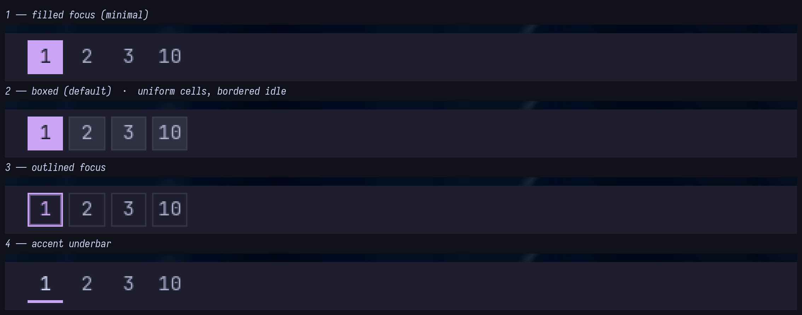
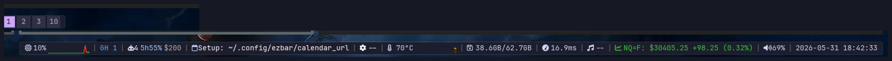
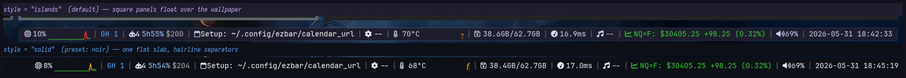
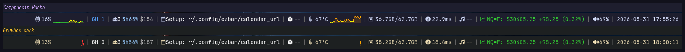
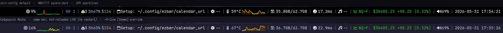
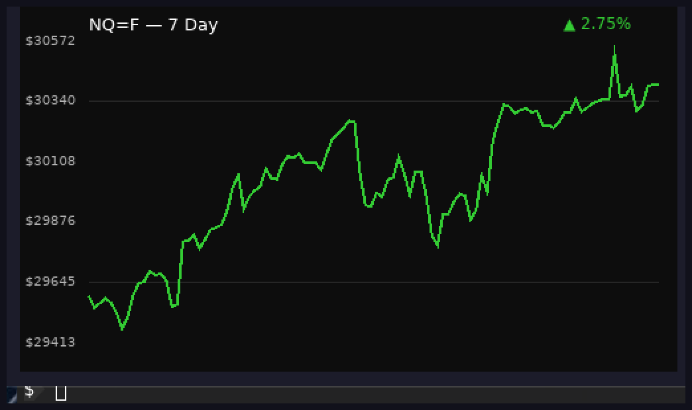

# RFC 0003: Built-in modules & visual system

- **Status:** Draft (v3 — real screenshots, square workspace chips, the preset
  switcher widget, and graph knobs; addresses the r/unixporn review)
- **Created:** 2026-05-31
- **Target:** ezbar (Rust / iced / wlr-layer-shell)
- **Depends on:** RFC 0001 (module SDK), RFC 0002 (config, theme tokens, presets, `ezbar msg`)

## Changelog (v3)

- **Real screenshots** of the running bar replace v2's "screenshot lands later" IOU —
  see *Default appearance*. The flat-vs-ashell and "designed default" claims are now
  shown, not asserted.
- **Workspaces become square state-chips** (state drives the *fill*, our square/dark
  identity — deliberately not ashell's rounded width-morphing pill), with **4
  selectable styles** (`boxed|filled|outlined|underbar`), click-to-switch, urgent
  blink, and per-workspace colors. Implemented; captured below.
- **Preset switcher widget** (`▾`) added to the component library and the OSD/popup
  family — the live theme switch from RFC 0002, a feature ashell has no equivalent of.
- **`metric_graph` knobs exposed** via `[modules.<id>.graph]` (RFC 0002): samples,
  height, line color/width, gradient fill, smoothing — the identity widget is now the
  most configurable thing, not a sentence.

## Changelog (v2)

- **Services are host-owned singletons,** not per-module subscriptions. Reviewers
  showed per-module D-Bus breaks on singletons (an SNI host registering twice is a
  protocol problem; two PipeWire consumers = two connections). v2 defines a
  host-driven `Service` keyed by *type*, ref-counted by subscriber count, fanned to
  modules.
- **Tier B split by real cost** and the comparison table no longer claims shipped
  parity. ashell's `services/` is ~10k LOC (network alone ~3.3k incl. generated
  D-Bus bindings); v1 hid that behind one paragraph.
- **Icon system honest + metric-correct.** "Nerd Font + typed enum" is ashell's
  *baseline*, not a differentiator; we say so. Our `Icon→codepoint` map is authored
  from the upstream Nerd Font cheat-sheet (not transcribed from theirs); **no custom
  font**. Glyph **baseline/advance normalization** (fixed-width box, vertical-center)
  is promoted to first-class — it's where "non-programmer-made" actually lives.
- **No in-tree `animated_size`.** v1's description matched ashell's widget near
  verbatim (copying risk). v2 uses the external `iced_anim` crate; honest about its
  real cost (it needs `Animated<T>` state + a tick message; the host owns the island
  chrome).
- **Component framing honest:** the decomposition is what any iced bar converges on;
  implementations are independent; we build our **own** button taxonomy (not ashell's
  Solid/Outline × Primary/Danger state matrix).
- **`metric_graph` promoted** to a first-class shared component (the graph-forward
  identity, not six bespoke canvases).
- **A real "Default appearance" section** (palette, modules, look) — defaults are
  what 90% of users see.
- **`custom` module matched to ashell's** (streaming `listen_cmd`, regex→icon map,
  alert dot), bound to the subscription tier.
- **OSD designed** and coupled to `ezbar msg` (RFC 0002); **notifications** daemon is
  a hard refuse-if-owned, not an open question.

## Summary

A **visual foundation** (islands, an icon font with correct metrics, animations, a
shared component library, a first-class sparkline) plus a **built-in catalog** that
reaches modern-bar parity our own way, **keeping** ezbar's GPU graphs + dev widgets.
On RFC 0001 (`Module`s) and RFC 0002 (placement/theme/IPC).

## Relationship to ashell (learn, don't copy) + identity

Study their source for *how*; implement our **own**. No code, assets, fonts, or
glyph maps copied. Identity that's actually ours: **graph-forward** (GPU sparklines
are first-class — ashell has zero canvas graphs), the **dev widgets** (GitHub/
kubectl/stock/Claude/Spotify ashell lacks), and **sway**. The Part-2 desktop
capabilities (tray, media, settings) are *table stakes* across waybar/eww/ashell —
not ashell features we clone. "Flat default" only counts if the flat look is
*designed* (below), not inherited emoji.

## Part 1 — Visual system

### 1a. Islands / solid (host-owned)
From `theme.style` (RFC 0002). `islands` → host wraps each group in a `pill`
(`background × opacity`, `radius.group`, `border`); groups float with `spacing`; the
bar surface is transparent. `solid` → one bar bg + hairline `separator`s. Modules
draw content only — already how the host works (it inserts separators around each
`view` today).

### 1b. Icon font (correct metrics, our own map)
We use a **Nerd Font** — the same neutral baseline ashell uses; this is *not* a
differentiator, just the sane choice over emoji (today's `💾🌡️📅🤖` don't theme,
don't align, vary per font stack). What we own:
- A typed `Icon` enum with an `Icon→codepoint` map **authored from the upstream Nerd
  Font cheat-sheet**, not transcribed from ashell's enum. **No bundled `.otf`.**
- **Metric normalization is first-class** (the actual polish): Nerd glyphs have
  inconsistent vertical metrics + advance widths, so a naive `row![icon, text]` makes
  icons ride high and jiggle. Every icon renders in a **fixed-advance box,
  vertically centered to the text baseline**, with an optional per-glyph nudge table.
  Exposed as `ctx.icon(Icon::Cpu) -> Element` (host owns the font + box), so plugins
  get aligned icons for free. The per-glyph nudge table is **authored by ezbar** for
  the supported Nerd Font glyph set and shipped in `ezbar-plugin`; it is the
  load-bearing polish item — it must **not** ship empty, or icons jiggle and the
  "designed default" wobbles. The font is registered at daemon startup (`.font(...)`).

### 1c. Animations
Use the external **`iced_anim`** crate (compatible with iced 0.14), **not** an
in-tree widget. Honest cost: animated values need `Animated<T>` state + a tick
message; since the **host** owns the island/popup chrome, the host holds that state
and drives ticks — modules don't animate their own width. Used for popup
expand/collapse, group/center width changes, toggle active-color fades. **Gated by
`theme.animations`**; off = instant, zero cost (the escape hatch).
**Center re-balancing:** with independent left/center/right zones, a truly centered
element must account for left+right widths or it twitches when the title grows; the
host animates the center element's offset (our own impl).

### 1d. Shared component library (`src/widgets/ui/`)
Cohesion comes from a shared vocabulary every builtin (and plugin, via re-export)
uses. The *decomposition* is what any iced bar converges on (ashell, eww too); our
**implementations are independent**, and we author our **own** button taxonomy
rather than copy a style matrix:

| component | use |
|---|---|
| `button` / `icon_button` | clickable chrome (our own size/kind taxonomy) |
| `slider` | volume, brightness |
| `toggle` | on/off + optional submenu in the settings panel |
| `popup_frame` | the dark rounded popup chrome (one themed definition; `[theme.popup]`) |
| `metric` | "icon + value", threshold-colored |
| **`metric_graph`** | **icon + value + inline GPU sparkline**, fully tunable via `[modules.<id>.graph]` (RFC 0002): `samples`, `height`, `line_color` (token/`$ref`/hex; default = threshold color), `line_width`, `fill = {gradient, alpha}`, `smooth`. The graph-forward identity, shared so cpu/mem/temp/ping/net/disk are visually identical, not bespoke. |
| `ws_chip` | one workspace as a **square, state-filled cell** (§1e) |
| `switcher` | the `▾` preset button + its popup list (§1f) |
| `pill` | the islands container |

### 1e. Workspaces — square state-chips (our identity)
ashell's technique (studied, not copied): each workspace is a button whose **width**
encodes state (active `xl` > visible `lg` > hidden `md`) and **animates** between
them — a rounded, morphing pill. We take the *idea* (state-aware, clickable) and make
it ours: a **square cell where state drives the fill**, not the width.

- States from sway IPC: `focused` (active on the focused output), `visible` (active on
  another monitor), `urgent`, and idle. Colors are `[theme.workspaces]` tokens, with
  an optional per-workspace `colors=[…]`/`special=[…]` palette (indexed by sort order;
  documented, not magic).
- Four selectable styles via `[theme.workspaces].style` — all square, all live-
  switchable, captured here on the Mocha preset:

  

  | style | look |
  |---|---|
  | `filled` | only the active ws is a solid accent square; others plain text |
  | `boxed` *(default)* | every ws is a square cell; active = accent fill, others = subtle box |
  | `outlined` | active = square accent **border** (no fill); others plain |
  | `underbar` | numbers + a 2px accent bar under the active ws |
- **Clickable** (click → switch workspace via sway IPC), **urgent blinks**, scroll-to-
  cycle (trackpad pixel-accumulator, learned from ashell) is a follow-up. Width-morph
  animation is *available* but **off by default** — the square fill already reads
  instantly and motion is gated by `theme.animations`.

### 1f. Preset switcher (the `▾`)
The live theme switch from RFC 0002, surfaced on the bar. A small `▾` `icon_button`
(`[bar].switcher`, default right end) opens a `popup_frame` list of presets (inline +
the `presets/*.toml` drop-ins), current one marked; selecting one applies **live** via
the theme-only hot-reload path (no module churn, feels instant) and persists to the
state file. Also driven headless by `ezbar msg preset <name|next|prev>`. This is a
front-page feature with **no ashell equivalent**; it's why presets are worth the
machinery.

## Default appearance (what 90% see)

Zero-config must look **designed**, not "today's emoji bar". The default is **lilac
islands** — square panels floating over the wallpaper, dark base, flieder/lilac accent.
The **actual running default** (sway, wgpu/Vulkan), not a mockup — workspaces island +
the right cluster:



- `style = islands`, ezbar's own dark+lilac palette (`#1e1e2e` base, `#cba6f7` lilac
  primary, `#a6e3a1/#f9e2af/#f38ba8` ok/warn/urgent), square `[theme.workspaces]`
  chips, the icon font (no emoji), and **GPU sparklines** filled under the line. Square
  — radius is a hair (4), not a pill; deliberately not ashell's rounded islands.
- Default modules on: `workspaces · title │ cpu mem temp(graphs) · ping · clock ·
  volume battery`. Dev widgets (github/stock/claude/kubectl/calendar/spotify) ship but
  are **opt-in** in config (they need tokens/setup); the capture shows them enabled.
- The look is a token swap away: `style = "solid"` gives the flat **noir** slab, and
  any palette re-skins **live** with no restart:

  

- Because theming is a token layer, any palette round-trips — same chrome, different
  scheme (Mocha and Gruvbox shown, from the shipped `presets/`), and a live `[theme]`
  hot-swap (default → Mocha, no restart):

  
  

- Popups are **real layer-shell surfaces**, not overlays — a dark square `popup_frame`
  (`[theme.popup]`). The stock popup carries the graph-forward identity into the detail
  surface with a GPU 7-day chart:

  

## Part 2 — Built-in catalog

Every entry is an RFC 0001 `Module`, placed/configured via RFC 0002.

### Tier A — bar modules (no D-Bus; land first)

| module | origin | does | popup |
|---|---|---|---|
| workspaces | have→**chips** | sway ws as **square state-chips** (§1e), 4 styles, click-switch, urgent blink; **special/scratchpad**, **visibility modes**, **scroll pixel-accumulator** are follow-ups | — |
| window_title | have | focused title/app-id; truncate modes; feeds center re-balance | — |
| clock | have→extend | time/date **+ calendar + weather** | calendar+forecast |
| cpu / memory / temperature | **have (graphs)** | `metric_graph` (GPU sparkline + threshold color) | — |
| disk / net / ip | new | `metric` / `metric_graph` (net throughput) | — |
| ping | have | latency `metric_graph` | — |
| updates | new | `check_cmd` count; click runs `update_cmd` | list |
| keyboard layout / submap | new | layout / sway submap | switch |
| battery / volume | have | level icon + %; volume → **OSD** on change | — |
| github / kubectl / stock / spotify / claude | **unique** | ezbar-only; keep | existing |
| `custom` | new | **command-driven, no-code** (below) | optional |

**`custom` (matched to ashell's, our impl):** a `poll` command *or* a long-lived
**`listen_cmd`** streaming JSON lines (`{text, alt}`, swaync-style); a **regex→icon
map** (swap glyph by output, not one fixed icon); an **`alert` regex** that paints a
danger dot; click runs a command. **Bound to the subscription/`Task` tier** (never
`update`/`view`) — it's the one module a non-Rust user can wedge.

### Tier B — desktop/control (host services; phased by cost)

**Cheap (land after Tier A):** `tray` (SNI), `media` (MPRIS + art + transport),
`osd`, `privacy` (PipeWire mic/cam/screenshare dots).

**Expensive (demand-gated, not blanket parity):** `settings` quick-settings panel —
audio sink/source + `slider` and `brightness` `slider` **first**; then power menu
(per-action commands), peripheral battery (kbd/mouse/headset via UPower), idle
inhibitor; **network (WiFi scan + password dialog) and bluetooth gated on demand**
(largest lift, most duplicative of existing applets); `notifications` daemon.

**OSD design:** a transient layer surface, center-bottom, `slider`/arc + icon,
animate in/out, auto-dismiss (~1.5 s), **driven by `ezbar msg volume/brightness …`**
(RFC 0002 IPC) *and* by widget interaction — without the IPC it's only half an OSD.

**Notifications:** acquire `org.freedesktop.Notifications` **without replace** and
**refuse to start if mako/swaync holds it** (hard requirement, not optional).

### The `services` layer (host singletons)

```rust
/// Host-internal: one long-lived D-Bus (or proto) connection, owned by the HOST.
trait Service { type Event; fn run(&self) -> Subscription<Self::Event>; }
```

- The host owns a `Services` registry keyed by **service type**; a service is spun up
  **once**, lazily, the first time a configured module needs it, and torn down when
  the last subscriber goes (ref-counted). **Modules never see `Service` or its
  `Subscription`** — they receive **host-defined `repr(C)`/serde data** via a fanned
  `Message` or a `ctx.service::<Audio>()` handle (consistent with RFC 0001: no
  `Any`/`TypeId` across the boundary). This is the SDK addition that makes "lazy +
  isolated" actually hold for singletons (SNI host, one PipeWire connection).
- Default bar-only config starts **no** services (footprint ≈ today).

## Comparison to ashell (target, honestly phased)

| | ezbar | ashell |
|---|---|---|
| islands / solid / icons / animations / components | ✅ (ours) | ✅ |
| **system graphs** | **GPU `metric_graph`** (tunable) | text indicators |
| **preset switcher (`▾`)** | ✅ live, on-bar + `msg` | ⛔ |
| workspace chips | ✅ square, 4 styles | ✅ rounded width-morph |
| tray / media / privacy / OSD | 🟡 Tier B cheap (planned) | ✅ shipped |
| settings panel (audio+brightness) | 🟡 Tier B (planned) | ✅ shipped |
| settings: network/bluetooth/VPN | 🟠 demand-gated | ✅ shipped |
| notifications daemon | 🟡 planned, refuse-if-owned | ✅ shipped |
| dev widgets / programmable plugins | ✅ unique | ⛔ |
| compositor | sway | Hyprland/Niri |

(🟡 planned, 🟠 maybe — we do **not** claim shipped parity for Tier B.)

## Phasing

1. **Visual foundation** (Part 1) + re-skin existing widgets + the designed default —
   immediate "looks nice" win, no new module.
2. **Tier A** ports (disk/net/ip, updates, keyboard, `custom`, clock+weather).
3. **`services` singletons + Tier B cheap** (tray → media → osd → privacy).
4. **Tier B expensive**, audio/brightness first; network/bt demand-gated.

## Open questions

1. Curated ezbar icon subset vs depend on a Nerd Font (default: depend; revisit if
   missing glyphs/alignment bite).
2. Does `media` (MPRIS) retire the bespoke Spotify widget, or both stay?
3. Settings-panel scope ceiling — commit to audio+brightness+power; gate the rest.
